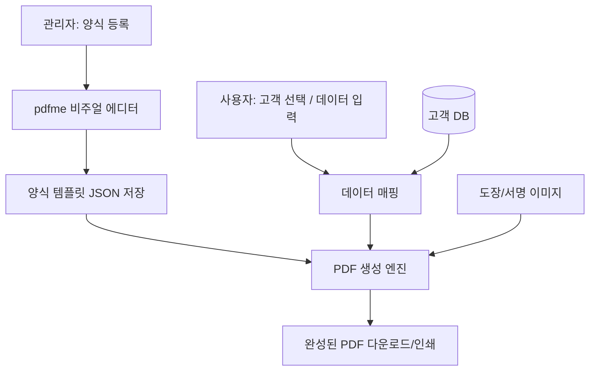

# 양식 자동화 플랫폼 사업 분석

## 목표

행정사/법무사 대상으로 **국가표준 양식을 자동으로 채워주는 웹 플랫폼**을 구축한다.

## 핵심 요구사항

1. **양식 원본 보존** — 스캔한 양식 PDF를 변형 없이 그대로 사용
2. **시각적 필드 지정** — 코딩 없이 마우스로 입력 영역 드래그 지정
3. **폰트/크기 매칭** — 원본과 동일한 폰트, 크기 설정 가능
4. **DB 연동** — 고객 리스트에서 데이터 자동 채움
5. **도장/이미지** — 도장, 서명 이미지도 원본 위에 오버레이
6. **대량 처리** — 한 양식에 여러 고객 데이터로 일괄 PDF 생성

---

## 솔루션 비교

### SaaS (외부 서비스 활용)

| 서비스 | 핵심 기능 | 가격 | 한글 지원 | 적합도 |
|---|---|---|---|---|
| **DocSpring** | PDF 업로드 → 드래그로 필드 지정 → API로 채우기 | 월 $59~ | 커스텀 폰트 가능 | ★★★★ |
| **Anvil** | PDF 필드 자동 감지 + 시각적 편집기 + e-서명 | 월 $60~ | 커스텀 폰트 가능 | ★★★★ |
| **PDFMonkey** | HTML 템플릿 기반 PDF 생성 | 월 $15~ | 가능 | ★★★ |
| **Adobe Acrobat Pro** | 폼 필드 자동 인식 + 편집 + JavaScript | 월 ₩26,400 | 완벽 | ★★★ |

> [!IMPORTANT]
> DocSpring/Anvil은 **양식 원본에 드래그로 필드를 지정**하는 비주얼 에디터를 제공하여 좌표 코딩이 불필요합니다. 다만 월 비용이 발생하고 해외 서비스라 한국 양식 특화 기능은 없습니다.

### 오픈소스 / 셀프 호스팅

| 프로젝트 | 핵심 기능 | 기술 스택 | 적합도 |
|---|---|---|---|
| **[pdfme](https://pdfme.com)** | PDF 위에 WYSIWYG 템플릿 에디터, JSON 기반 | TypeScript/React | ★★★★★ |
| **[DocuSeal](https://docuseal.com)** | PDF 폼 채우기 + 서명 + 셀프 호스팅 | Ruby on Rails | ★★★★ |
| **[Stirling PDF](https://github.com/Stirling-Tools/Stirling-PDF)** | PDF 편집 전반 (50+ 기능) | Java/Docker | ★★★ |

> [!TIP]
> **pdfme가 가장 유력한 후보.** React 기반 **비주얼 템플릿 에디터**를 제공하며, PDF를 배경으로 올리고 마우스로 텍스트/이미지 필드를 배치한 뒤, JSON 데이터를 넣으면 완성된 PDF가 나옵니다. 오픈소스(MIT)이므로 사업화 가능.

### 한국 시장 기존 플레이어

| 회사 | 주요 제품 | 특징 |
|---|---|---|
| **사이냅소프트** | 사이냅 OCR IX, 도큐애널라이저 | HWP 포함 공공문서 AI 분석, 공공기관 납품 |
| **레드브릭** | 행정 서류 자동화 AI | 공공기관 대상 솔루션 |
| **한국법률데이터** | OCR AI RPA, 우리민원 | 법률 문서 자동화, 서류 발급 대행 |
| **lawform.io** | 법률 문서 자동 작성 | 변호사 설계 기반, 작성+서명+관리 |

---

## 추천 아키텍처: pdfme 기반 자체 플랫폼



### 워크플로우

**1단계: 양식 등록 (1회)**
```
양식 스캔 PDF 업로드
    → pdfme 에디터에서 PDF 배경 위에 입력 필드 드래그 배치
    → 필드별 폰트, 크기, 정렬 설정
    → 필드와 DB 컬럼 매핑 (이름→고객명, 주소→고객주소 등)
    → 템플릿 저장
```

**2단계: 문서 생성 (매일)**
```
양식 선택 → 고객 선택 (DB에서)
    → 자동으로 모든 필드 채움 (도장 이미지 포함)
    → PDF 미리보기 → 인쇄/다운로드
```

### 기술 스택 제안

| 레이어 | 기술 | 역할 |
|---|---|---|
| **프론트엔드** | React + pdfme | 템플릿 에디터 + 고객 관리 UI |
| **백엔드** | FastAPI (Python) 또는 Next.js | API, DB, 인증 |
| **PDF 생성** | pdfme/generate 또는 pikepdf+reportlab | 서버사이드 PDF 생성 |
| **DB** | PostgreSQL | 고객, 양식 템플릿, 도장 이미지 |
| **배포** | Docker + 클라우드 (AWS/NCP) | 웹 서비스 호스팅 |

---

## 다음 단계

> [!IMPORTANT]
> 아래에서 어떤 방향으로 갈지 결정이 필요합니다.

### 옵션 A: 외부 SaaS 활용 (빠른 시작)
- DocSpring 또는 Anvil 무료 체험 → 기존 양식으로 테스트
- 장점: **즉시 시작 가능**, 인프라 불필요
- 단점: 월 비용, 데이터 해외 저장, 한국 최적화 부족

### 옵션 B: pdfme 기반 자체 개발 (사업화용)
- pdfme 오픈소스를 활용해 **양식 자동화 웹 플랫폼** 자체 개발
- 장점: **완전한 통제권**, 한국 양식 최적화, SaaS로 판매 가능
- 단점: 개발 시간 필요 (MVP 2~4주)

### 옵션 C: 하이브리드
- Adobe Acrobat으로 양식에 폼 필드 설정 → Python으로 자동 채우기
- 장점: 검증된 도구, 안정적
- 단점: Adobe 라이선스 비용, 확장성 제한
